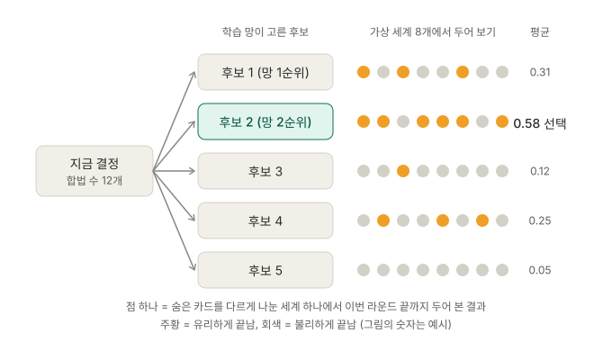

# 탐색 AI는 어떻게 두나

플레이 서버의 좌석 목록에 나오는 **탐색 AI**(Search AI, 좌석 종류 `search:<체크포인트>`, 코드 `src/dune_imperium/agents/network_search_agent.py`의 `NetworkSearchAgent`)를 설명한다.

한 줄로 말하면 이렇다. 학습한 망의 직감으로 후보 몇 개를 고르고, 각 후보를 머릿속으로 이번 라운드 끝까지 두어 본 다음, 결과가 가장 좋은 수를 둔다. 사람이 "이 칸에 가면 어떻게 될까, 저 카드를 사면?" 하고 몇 수 앞을 그려 보는 것과 같다.

## 재료: 학습한 망 하나

M10 학습으로 만든 정책·가치 망이 국면을 보고 두 가지를 내놓는다.

- **정책**: 지금 둘 수 있는 수마다 "좋아 보이는 정도" 점수를 낸다.
- **가치**: "지금 이 국면이면 내가 이길 가능성이 어느 정도인가"를 추정한다.

망만 쓰는 AI(`checkpoint:<체크포인트>` 좌석)는 정책 점수 1등을 바로 둔다. 직감만으로 두는 셈이다.

## 결정 하나를 고르는 네 단계

그림의 순서대로다. 숫자는 지금 기본값이다(`DEFAULT_CANDIDATES`, `DEFAULT_ROLLOUTS`, `DEFAULT_HORIZON_ROUNDS`).

1. **후보 줄이기.** 합법 수 가운데 정책 점수 상위 **5개**만 남긴다. 같은 라운드에 같은 국면에서 이미 둔 수는 빼서 같은 수를 되풀이하지 않게 한다.
2. **가상 세계 만들기(결정화).** 이 좌석이 모르는 정보는 아는 것과 모순되지 않게 무작위로 다시 나눈다. 상대 손패, 덱 순서, 책략 카드 같은 것들이다. 이렇게 그럴 법한 세계 **8개**를 만든다(`agents/determinize.py`). 상대 패를 엿보지 않으며, 숨은 정보가 새지 않는다는 것은 따로 검사했다(2026-09-23, [evaluation/m10-2026-09-22.md](evaluation/m10-2026-09-22.md) 12절).
3. **두어 보기(플레이아웃).** 세계마다 후보를 하나씩 둔 뒤, 네 좌석 모두를 망이 대신 두어 **이번 라운드 끝까지** 진행한다. 다섯 후보는 같은 세계, 같은 무작위 결과(카드 뽑기 등)에서 비교한다. 그래서 결과 차이는 그 후보 때문에만 생긴다.
4. **고르기.** 라운드 끝 국면을 망의 가치로 점수 매긴다. 그사이 게임이 끝났으면 실제 결과(1등이면 이김)를 쓴다. 8개 세계의 평균이 가장 높은 후보를 둔다.

그림의 예에서 망은 후보 1을 가장 좋게 봤다. 그런데 실제로 두어 보니 후보 2가 더 자주 유리하게 끝나서, 탐색 AI는 후보 2를 둔다. 직감이 틀리는 수를 검증이 걸러 내는 것, 이것이 탐색이 망 혼자보다 강한 이유다.

결정 하나에 5 × 8 = 40번을 두어 보므로 시간이 든다. UI 기본 규칙에서 탐색한 결정은 평균 1.4초, 느린 것은 3.3초쯤이다. 그래서 서버는 탐색 AI 좌석을 뒤에서 생각하게 하고, 그동안 화면은 멈추지 않으며 그 좌석의 배지에 "생각 중…"이 뜬다.

다음 결정은 탐색하지 않고 망이 바로 둔다.

- 고를 수 있는 수가 하나뿐일 때
- 남은 후보가 하나뿐일 때
- 에이전트 턴 안에서 효과를 푸는 순서를 정할 때(탐색해도 결과가 거의 달라지지 않아 시간만 든다)

## 세 가지 AI 비교

| | 고르는 방식 | 앞을 보나 |
|---|---|---|
| 앱 AI (`app_ai`) | Steam 앱의 점수표로 지금 한 수의 이득을 계산해 바로 고른다 | 안 본다 |
| 망 혼자 (`checkpoint:`) | 학습한 직감 1등을 바로 둔다 | 안 본다 |
| 탐색 AI (`search:`) | 직감으로 후보를 줄이고 가상 세계에서 두어 보아 검증한다 | 이번 라운드 끝까지 |

2026-10-06 L3 망(8081)으로 잰 강도는 다음과 같다. UI 기본 규칙 + Scouts에 드래프트를 켰고, 학습에 쓰지 않은 시드로 쟀다([evaluation/m10-2026-10-06.md](evaluation/m10-2026-10-06.md)).

- **망 혼자 대 앱 AI·어려움**(2:2, 1,400판): 좌석당 29.5% 대 20.6%.
- **탐색 AI 1석 대 앱 AI·어려움 3석**(200판): 72% 승. 동률이면 25%다.

## 한계

- 이번 라운드 끝까지만 직접 두어 보고, 그 뒤는 망의 가치 추정을 믿는다. 가치 추정이 틀리면 탐색도 틀린다.
- 두어 보는 동안 상대도 같은 망처럼 둔다고 가정한다. 사람이 전혀 다른 방식으로 두면 예측이 빗나갈 수 있다.
- 망이 배운 적 없는 규칙의 결정은 약하다. 지금 망(8081)은 모든 확장과 드래프트를 배웠다.

## 쓰는 법

서버가 망 파일을 찾고 PyTorch(`train` extra)가 깔려 있을 때만 좌석 목록에 나온다. 망을 찾는 순서는 다음과 같다.

1. `dune-imperium-server --search-checkpoint 경로`
2. 환경 변수 `DUNE_IMPERIUM_SEARCH_CHECKPOINT`
3. 저장소 안 `checkpoints/play/search.pt`(git 무시, 보통 같은 폴더의 가중치 사본을 가리키는 심볼릭 링크)

서버를 띄우면 콘솔에 `search AI: <파일>` 또는 `search AI: off (…)` 줄이 하나 나온다. 저장 파일은 그 망 파일에 묶이므로, 새 망은 새 이름으로 두고 링크만 바꾼다([remote-play-host-guide.md](remote-play-host-guide.md) "탐색 AI 좌석" 절).
